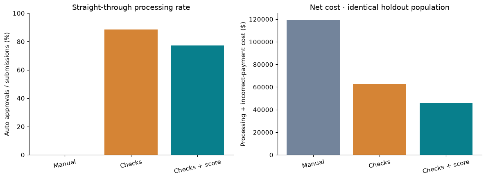
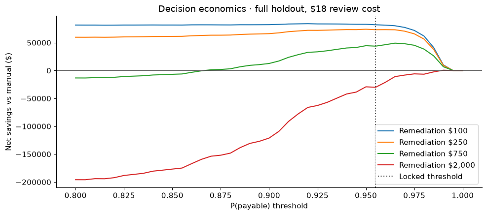

# Medicare Part B Claims Straight-Through Processing & Decision Economics

**Which claims can be approved automatically—and when does automation actually save money?**

Healthcare data analytics · PostgreSQL · SQL · Python · Jupyter

[Project methodology](methodology.md) · [Data analysis notebook](notebooks/01_data_and_sql.ipynb) · [Decision economics notebook](notebooks/02_decision_economics.ipynb) · [SQL](sql)

## The business problem

When a healthcare provider submits a claim, the claims team needs to determine whether it should be paid. Reviewing every submission takes time and costs money. Automatically approving too many can result in incorrect payments.

This project examines that trade-off for a selected group of Medicare Part B claims. **Straight-through processing** means approving a submission without the manual review modeled here.

The goal is to find a useful balance between faster processing, payment accuracy and cost—not simply to automate the largest number of claims.

## The approach

I compared three policies on the same **6,627 submissions** from a later evaluation period:

| Policy | What happens to an incoming claim? |
|---|---|
| Manual review | Every submission goes to a reviewer. |
| Basic checks | Automatically approve submissions that pass coverage, documentation and billing checks. |
| Checks plus score | Apply the same checks, then require a sufficiently high estimated probability that the submission is payable. |

All other submissions go to review. **Review is not denial:** an unusual claim can still be valid and paid after review.

SQL features describe earlier submission activity, repeat services, provider payment history, billing amounts and units. The score uses information available at submission. Final payment outcomes remain separate from the decision to approve or review.

## What the analysis found

Default assumptions: **$18 per review**, **$0.35 per automatic approval**, and **$250 plus the scheduled payment amount for each incorrect approval**.

| Policy | Automatically approved | Incorrect approvals | Total decision cost | Net savings vs. manual |
|---|---:|---:|---:|---:|
| Manual review | 0.0% | 0 | $119,286 | $0 |
| Basic checks | 88.4% | 159 | $62,524 | $56,762 |
| Checks plus score | 77.3% | 59 | $46,092 | $73,194 |

**Approving fewer claims automatically produced greater savings.** Compared with basic checks, adding the score prevented 100 incorrect approvals and saved an additional **$16,431**, while sending 735 more submissions to review.

For the combined policy, $92,214 in avoided review expense became **$73,193.80 in net savings** after automatic-processing and incorrect-approval costs. This distinction prevents gross administrative savings from overstating the financial benefit.

Estimated handling effort fell from 1,325 hours under manual review to 322 hours under the combined policy. These are calculations based on assumed processing times, not measured staffing improvements.

## When the conclusion changes

Automation was not always the least expensive option. With review costing $8 and incorrect-approval remediation costing $2,000, the combined policy at its existing threshold became more expensive than manual review.

The business implication is that **the approval policy must reflect both review cost and payment-error exposure**. A policy that works under one cost structure may not work under another.

## Why this matters

Claims managers can use this analysis to understand remaining review workload. Payment integrity teams can examine incorrect payments. Finance analysts can assess whether efficiency gains justify the cost of errors.

The results support further validation of checks plus score under realistic operating costs. They also show why valid claims sent to review must be monitored: the combined policy referred 1,185 ultimately payable submissions.

## Data and boundaries

The project uses **24,000 reproducible synthetic claim submissions**, involving 2,200 patients and 120 providers, from January 2025 through June 2026. Public **CMS 2023 Physician/Supplier Procedure Summary** aggregates ground selected amount and denied-service assumptions. No identifiable patient records are used, and savings are project scenarios rather than realized payer outcomes.

The scope is limited to five procedure codes in an office-service setting. Manual review is assumed accurate. Implementation costs, appeals and patient outcomes are not evaluated. The project does not implement complete Medicare payment rules or automatic denial.

## Explore the analysis

| File | What you will learn |
|---|---|
| [methodology.md](methodology.md) | The analytical story from business question to recommendation |
| [Notebook 1](notebooks/01_data_and_sql.ipynb) | Where the data came from and how historical features were checked |
| [Notebook 2](notebooks/02_decision_economics.ipynb) | Policy results, net savings, reliability and cost sensitivity |
| [Schema SQL](sql/01_schema.sql) | How claims, patients and providers are organized |
| [Feature SQL](sql/02_features.sql) | How earlier claims become decision-time features |
| [Reporting SQL](sql/03_reporting.sql) | How claim decisions become business KPIs |
| [Source notes](docs/DATA_SOURCES.md) | CMS references, transformations and data limitations |

Both notebooks contain executed outputs and charts. Supporting Python code, data, assumptions and validation evidence are included. The [validation receipt](docs/VALIDATION.md) records the checks performed.
