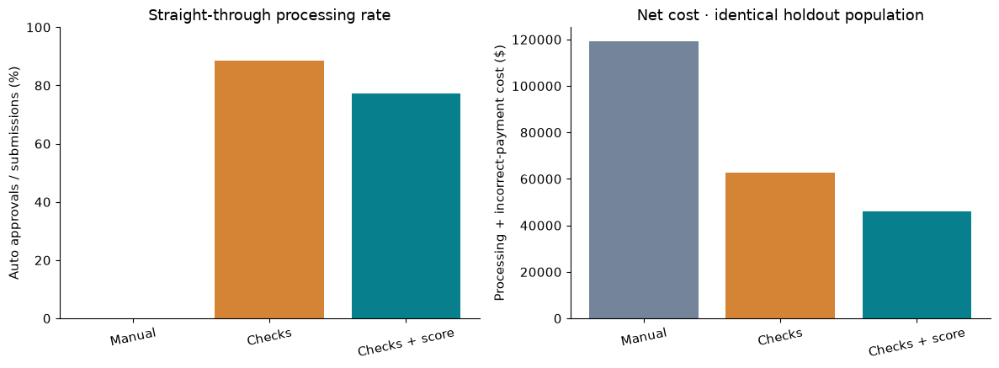
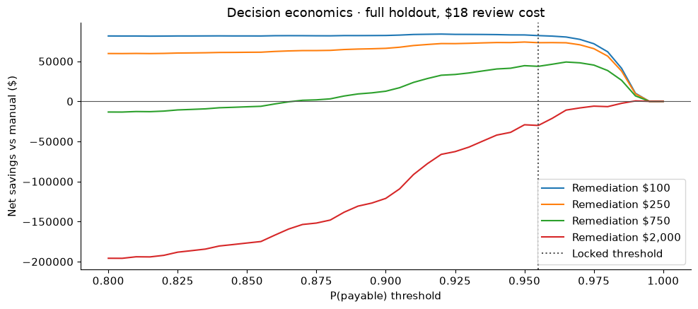

# Medicare Claims Processing and Payment Integrity Analytics

**Which Medicare claims can be approved automatically, and when does automation save money without letting payment errors through?**




---

## Project Overview

| | |
|---|---|
| **Domain** | Healthcare payer operations: Medicare Part B claims processing and payment integrity |
| **Business problem** | Reviewing every claim is slow and expensive, but approving claims automatically risks paying claims that should not be paid |
| **Stakeholders** | Claims operations managers, payment integrity teams, finance |
| **Data** | 24,000 synthetic claim submissions (2,200 patients, 120 providers, Jan 2025 to Jun 2026), calibrated to public CMS 2023 billing and denial data |
| **Tools** | PostgreSQL, SQL, Python (pandas, scikit-learn), Jupyter |
| **Output** | A side-by-side comparison of three claim-routing policies on cost, workload and payment errors, with a sensitivity analysis showing when the answer changes |

## Key Results

Evaluated on **6,627 claims** from a later time period that was never used to build or tune the model.

| | Manual review | Basic checks | Checks plus score |
|---|---:|---:|---:|
| Claims approved automatically | 0% | 88.4% | **77.3%** |
| Incorrect approvals | 0 | 159 | **59** |
| Incorrect approvals as a share of auto-approvals | n/a | 2.7% | **1.2%** |
| Total processing and error cost | $119,286 | $62,524 | **$46,092** |
| **Net savings vs. manual review** | $0 | $56,762 | **$73,194** |
| Estimated handling hours | 1,325 | 178 | 322 |

- **Approving fewer claims automatically saved more money.** Adding the score sent 735 more claims to review but prevented 100 incorrect approvals, adding **$16,431** in savings over basic checks.
- **The result held up month to month.** The combined policy auto-approved 76% to 79% of claims in every holdout month, with 11 to 15 incorrect approvals per month.
- **Savings are not driven by a few providers.** Resampling providers gives a 95% range of **$65K to $81K** in net savings.

---

## Business Problem

Every claim a provider submits has to be checked before Medicare pays it. When every claim goes to a human reviewer, routine claims wait in the same queue as risky ones, and the review bill grows with volume.

Approving the easy claims automatically looks like the obvious fix. But every incorrect approval means a payment that has to be recovered, plus the cost of fixing it. **A small error rate can erase the savings from faster processing.**

Most automation projects report how many claims were automated. This project asks the question finance and payment integrity teams care about: **after counting the cost of mistakes, does automation still save money, and under what conditions?**

## Business Questions

1. How many claims can be approved automatically using standard intake checks alone?
2. Does adding a risk score improve the trade-off between automation and payment errors?
3. What is the net financial result once incorrect payments are counted?
4. At what review and error costs does automation stop being worth it?

---

## Approach

### Three policies, compared on the same claims

| Policy | How a claim is handled |
|---|---|
| **Manual review** | Every claim goes to a reviewer (the baseline) |
| **Basic checks** | Auto-approve claims that pass coverage, enrollment, timely filing, documentation, duplicate, units and billing checks |
| **Checks plus score** | Same checks, plus the model must estimate at least a 95.5% chance that the claim is payable |

Claims that are not auto-approved go to review. **Review is not denial:** many reviewed claims are valid and get paid.

### Features built in SQL

For each incoming claim, the SQL looks back only at information available **at the moment it was submitted**:

- How many claims the patient and the provider submitted in the previous 90 days
- The provider's payment track record, using only claims that had already been decided
- How the billed amount and units compare with recent claims for the same procedure
- Whether the claim looks like a duplicate or repeats a recent service
- Intake flags for coverage, enrollment, late filing, documentation and billing exceptions

This uses window functions with time-based ranges and lateral joins, so a claim can never "see" future claims or outcomes it would not have had in real life.

### Time-based model development

| Period | Purpose |
|---|---|
| Jan to Sep 2025 | Train a gradient boosting model to estimate the probability that a claim is payable |
| Oct to Nov 2025 | Calibrate the probabilities so that 95% means about 95% |
| Dec 2025 to Jan 2026 | Choose the approval threshold by lowest total cost, with a cap on the error rate |
| **Feb to Jun 2026** | **Final evaluation on untouched claims** |

The model reached an ROC AUC of 0.86 on the final period.

---

## Payment Integrity Findings

### Where the remaining errors come from

| Error type | Claims in holdout | Auto-approved by basic checks | Auto-approved with score |
|---|---:|---:|---:|
| Medical necessity failure | 139 | **139 (all)** | 54 |
| Unresolved documentation | 37 | 12 | 3 |
| Billing anomaly | 40 | 4 | 1 |
| Coverage failure | 74 | 4 | 1 |
| Duplicate | 88 | 0 | 0 |

Intake checks catch duplicates, coverage and billing problems well, but **they cannot see medical necessity failures at all**. The score stopped 85 of these 139 claims. **The remaining 54 make up 54 of the 59 incorrect approvals**, so medical necessity is where any further payment integrity effort should focus.

### The cost of caution

The score is not free. It sent **1,185 valid claims** to review, compared with 550 under basic checks. These claims still get paid, but they wait longer and cost $18 each to review. Tracking valid claims sent to review is as important as tracking errors.

---

## When the Answer Changes

Net savings of **checks plus score** vs. manual review, at the chosen threshold:

| Review cost per claim | Error cost $100 | Error cost $250 | Error cost $750 | Error cost $2,000 |
|---|---:|---:|---:|---:|
| **$8** | $30,814 | $21,964 | **-$7,536** | **-$81,286** |
| **$18** (default) | $82,044 | **$73,194** | $43,694 | **-$30,056** |
| **$35** | $169,135 | $160,285 | $130,785 | $57,035 |

*Error cost is the remediation cost per incorrect approval, in addition to the payment itself.*

- **Automation loses money when reviews are cheap and errors are expensive.** At $8 per review, the combined policy costs more than manual review once an error costs $750 or more.
- **Basic checks alone break even much sooner.** They lose money at $8 per review with $250 errors, and at $18 per review with $750 errors.
- **The threshold must match the cost structure.** A threshold that saves money under one set of costs can lose money under another.



---

## Recommendations

1. **Use checks plus score over basic checks.** It saved more under the default assumptions and in 11 of the 12 cost scenarios tested. Basic checks came out ahead only when reviews were expensive ($35) and errors were cheap ($100).
2. **Focus payment integrity work on medical necessity.** It accounts for almost all remaining incorrect approvals, and intake checks cannot detect it.
3. **Set the threshold from real costs.** Measure actual review and recovery costs before choosing a threshold, and revisit it when those costs change.
4. **Monitor more than the automation rate.** Track incorrect payment dollars, valid claims sent to review, turnaround time and whether predicted probabilities still match reality.
5. **Test before changing live routing.** Run the policy in shadow mode on real claims before it affects payments.

---

## Data

The claims are **synthetic**, generated so that the full history of every claim is known. Public **CMS 2023 Physician/Supplier Procedure Summary** data sets the billed amounts, payment amounts and denial rates for five office-based procedures:

| Code | Service |
|---|---|
| 99213, 99214 | Office visits for established patients |
| 80053 | Comprehensive metabolic panel |
| 93000 | Electrocardiogram (ECG) |
| 97110 | Therapeutic exercise |

The data includes routine claims, duplicates, corrections, missing documentation, coverage failures, billing anomalies and **legitimate unusual claims**, so that "unusual" never automatically means "wrong." Each claim's final payment outcome is generated separately from the intake data, and the model never creates its own labels. No real patient records are used.

## Limitations

- **Synthetic claims.** Results show the method and the trade-offs, not the performance a real payer would see.
- **Assumed costs.** Review cost ($18), automatic processing cost ($0.35) and error remediation ($250 plus the payment) are scenario settings. Of the $17,227 error cost in the combined policy, $14,750 comes from the assumed remediation fee and $2,477 from the payments themselves.
- **Manual review is treated as always correct**, which overstates the baseline.
- **Narrow scope.** Five procedure codes in an office setting, with simplified Medicare payment rules. Appeals, implementation costs and patient outcomes are not modeled.
- **Probability calibration did not help.** The calibration step slightly worsened the final Brier score (0.0385 to 0.0390), so it is reported but not claimed as an improvement.

---

## Repository Structure

| Folder / file | Contents |
|---|---|
| [`methodology.md`](methodology.md) | The full analytical story from business question to recommendation |
| [`notebooks/`](notebooks/) | Executed notebooks: data and SQL checks, and decision economics |
| [`sql/`](sql/) | Schema, as-of feature engineering, and reporting views |
| [`src/`](src/) | Data generation, database loading, model training and policy evaluation |
| [`scripts/`](scripts/) | Pipeline runner, CMS source download, notebook and chart builders |
| [`tests/`](tests/) | 12 automated checks, including tests that future records cannot change past features |
| [`results/`](results/) | Policy summaries, sensitivity grid, monthly and segment results, claim-level decisions |
| [`docs/`](docs/) | Data dictionary, data sources, assumptions, methods and validation notes |

## How to Run

**Requirements:** Python 3.12, PostgreSQL 17

```bash
pip install pandas numpy scikit-learn psycopg requests joblib jupyter pytest
export DATABASE_URL="postgresql://<user>@<host>:<port>/<database>"

python scripts/fetch_sources.py   # download the CMS 2023 benchmark data
python scripts/build_all.py       # generate data, run SQL, train, evaluate, build notebooks, run tests
```

---

## Author

**Thrinesh Vuribindi**, Data Analyst

[](https://www.linkedin.com/in/thrineshvuribindi)
[](https://github.com/thrinesh13)
